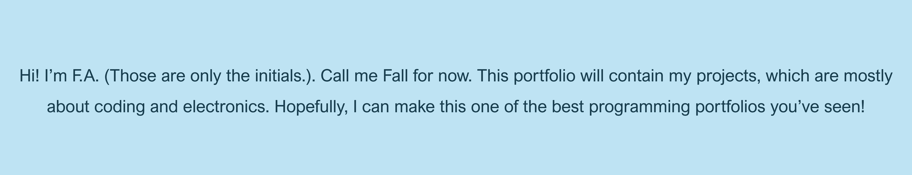

# This is a Portfolio

[Projects](Projects.md)

### About Me
I started when I was 9 with a software called P5.js. I learned from Daniel Shiffman's YouTube channel called [The Coding Train](https://www.youtube.com/@TheCodingTrain). I made a [tree using fractals](https://editor.p5js.org/F12/sketches/Db1CgRsBo), [abstract art](https://editor.p5js.org/F12/sketches/-IKibwxcz), [drawing game](https://editor.p5js.org/F12/sketches/vHkDAzvx-)s, + plus more.

Fast forward 2 years, I started learning from the "Elegoo Uno Super Starter Kit" that had been lying around. I watched the channel [BV3D](https://www.youtube.com/@BV3D)'s [Elegoo Uno Super Starter Kit Playlist](https://www.youtube.com/playlist?list=PLWdhcCYoOsiJE1DS7OhPfwrHrGlUED6Az) created by Bryan Vines. I made a project with an IR receiver and IR remote control that prints sentences and words on Arduino IDE serial monitor. I also made one with a tilt ball switch that lights up a LED and turns on a buzzer if anyone touches the project.

After a few months I decided to get a Raspberry Pi car from Freenove. After building and downloading everything, I had lots of fun... for some days. But then the load button failed and only the wheels worked, and then the power button failed and it stopped working completely. I still don't know how to fix it yet.

A few weeks later, I went back to Elegoo but this time I had to make a project that didn’t exist on BV3D. But if I combined 2 codes I all ready had, I could use it in the new project. After wiring everything and uploading the code, my Temperature and Humidity Meter was done. Some days later, it was time to upgrade the Temperature and Humidity. I replaced the Elegoo Uno board with a Esp32 and replaced the LCD screen with a Mosquitto . And that’s how my Temperature and Humidity Meter was upgraded!

Check out my projects at the projects tab above or [here](Projects.md)!

## Thanks!
